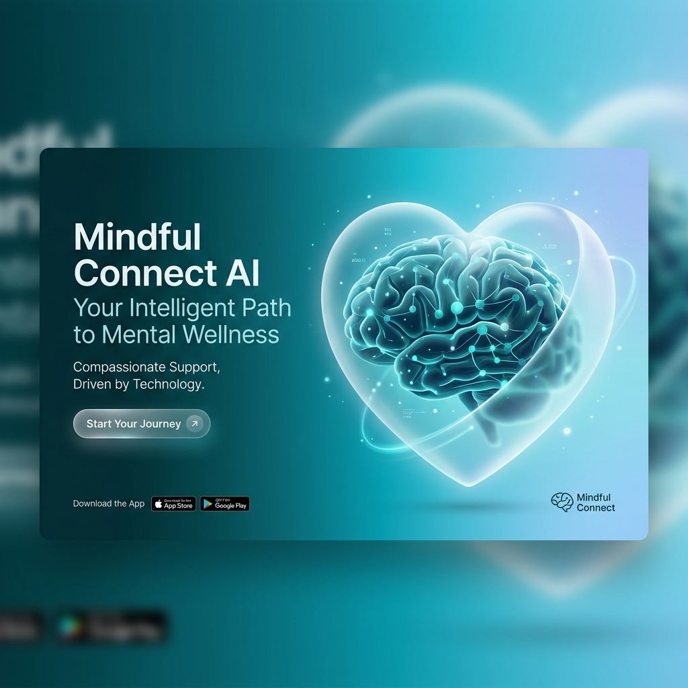
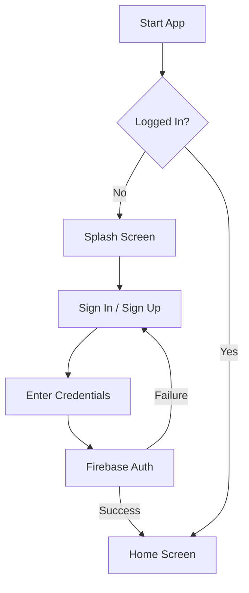
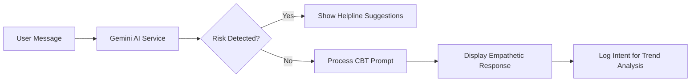
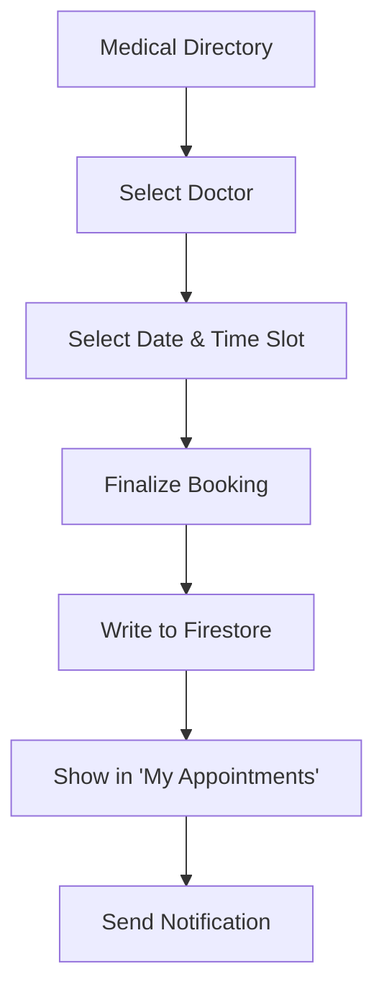

# AI-Powered Mental Health Companion 🧠💙



A cutting-edge, cross-platform mental health application built with **Flutter**, designed to provide accessible, personalized, and real-time support. It leverages **Artificial Intelligence (Google Gemini)** and community-driven features to bridge the gap between individuals and effective mental health resources.

---

## 👥 Contributor

| Profile | Name | GitHub | Role |
| :--- | :--- | :--- | :--- |
|  | **Smit (ByteNinjaSmit)** | [@ByteNinjaSmit](https://github.com/ByteNinjaSmit) | Lead Developer & Architect |

---

## 🌟 Project Overview
The rising prevalence of mental health issues like anxiety, depression, and stress is exacerbated by the limited availability of professional support, social stigmas, and financial constraints. This project serves as a 24/7 digital companion capable of detecting emotional states, conducting clinical-style diagnostic tests, and seamlessly connecting users to verified mental health professionals.

### **Key Objectives:**
- **Real-Time Support:** Deliver on-demand emotional backing through NLP and Generative AI.
- **Accessibility:** Ensure 24/7 localized support regardless of financial status.
- **Privacy & Security:** Safeguard sensitive clinical and personal data using robust encrypted backends.
- **Community Healing:** Foster peer-to-peer engagement via moderated forums.

---

## 🛠️ Technology Stack

- **Frontend:** Flutter & Dart (Cross-platform iOS/Android/Web)
- **State Management:** Provider
- **Backend Services:** Firebase (Auth, Firestore)
- **AI Core:** Google Gemini API (Natural Language Processing & Trend Analysis)
- **UI & Experience:** Google Fonts, Flutter Animate, Glassmorphism Design
- **Integration:** Youtube Player & Syncfusion PDF Viewer

---

## ⚙️ Environment Variables (`.env`)

To run this project, you will need to add the following environment variables to your `.env` file in the root directory:

| Key | Description |
| :--- | :--- |
| `GEMINI_API_KEY` | Your Google AI Studio API Key |
| `FIREBASE_API_KEY_WEB` | API Key for Firebase Web/Windows |
| `FIREBASE_APP_ID_WEB_WINDOWS` | App ID for Firebase Web/Windows |
| `FIREBASE_API_KEY_ANDROID` | API Key for Firebase Android |
| `FIREBASE_APP_ID_ANDROID` | App ID for Firebase Android |
| `FIREBASE_API_KEY_IOS` | API Key for Firebase iOS/MacOS |
| `FIREBASE_APP_ID_IOS` | App ID for Firebase iOS/MacOS |
| `FIREBASE_PROJECT_ID` | Your Firebase Project ID |
| `FIREBASE_MESSAGING_SENDER_ID` | Firebase Cloud Messaging Sender ID |
| `FIREBASE_AUTH_DOMAIN` | Firebase Authentication Domain |
| `FIREBASE_STORAGE_BUCKET` | Firebase Storage Bucket URL |

---

## 🚀 Module Working & Details

### 1. 🤖 AI Chatbot Therapist (CBT-Driven)
The heart of the application. Using the **Gemini 2.5 Flash** model, the chatbot operates as a compassionate mental health companion.
- **Functionality:** Employs Cognitive Behavioral Therapy (CBT) techniques to help users reframe negative thoughts.
- **Crisis Detection:** Integrated safety filters that detect mentions of self-harm and immediately route users to emergency helplines.
- **Logic:** Located in `lib/services/gemini_service.dart`.

### 2. 📋 Mental Health Assessments
A module for clinical-grade diagnostics including **PHQ-9 (Depression)** and **GAD-7 (Anxiety)** tests.
- **Dynamic Scoring:** Real-time calculation of risk levels (Minimal, Mild, Moderate, Severe).
- **Trend Analysis:** AI analyzes historical test results to provide "Compassionate Trends" summaries for the user.
- **Implementation:** Uses a modular question-answer system with `flutter_animate` for smooth transitions.

### 3. 📅 Medical Directory & Appointment Booking
A full-lifecycle scheduling system for professional help.
- **Doctor Discovery:** List of verified psychiatrists loaded from `assets/doctors.csv`.
- **Slot Selection:** Interactive date and time picking with native Flutter components.
- **Real-time Sync:** Appointments are saved to Firestore and updated via streams for the user's dashboard.

### 4. 🗣️ Community Forums (Anonymous Support)
A safe space for users to share and support.
- **Categories:** Organized by topic (Anxiety, Depression, PTSD, etc.).
- **Interactions:** Live liking, commenting, and threaded discussions.
- **Anonymity:** Users can choose to engage without exposing sensitive identity details.

### 5. 🏥 Crisis Helpline & Resource Hub
- **Direct Dial:** One-tap calling to emergency suicide prevention and domestic violence helplines.
- **Library:** Curated PDF guides and video therapy sessions powered by `syncfusion_flutter_pdfviewer` and `youtube_player_flutter`.

---

## 📊 Flow Charts

### User Authentication Flow


### AI Therapist Interaction Flow


### Appointment Booking Flow


---

## 🗄️ Database Schema (Firestore)

### Collection: `users`
| Field | Type | Description |
| :--- | :--- | :--- |
| `uid` | String | Unique Firebase User ID |
| `name` | String | User's Display Name |
| `email` | String | User's Email Address |
| `age` | String | User's age group |
| `role` | String | Role (user/doctor) |

### Collection: `appointments`
| Field | Type | Description |
| :--- | :--- | :--- |
| `userId` | String | Reference to User |
| `doctorName`| String | Name of the Psychiatrist |
| `specialization`| String | Area of expertise |
| `date` | String | Booking Date (YYYY-MM-DD) |
| `timeSlot` | String | Selected Time Window |
| `status` | String | booked / completed / cancelled |
| `createdAt` | Timestamp | Booking Creation Time |

### Collection: `posts` (Forum)
| Field | Type | Description |
| :--- | :--- | :--- |
| `userId` | String | Creator's UID |
| `text` | String | Post Content |
| `likes` | Number | Count of reactions |
| `timestamp`| Timestamp | Creation Date |

---

## 📦 Installation & Setup

### Prerequisites
- [Flutter SDK](https://docs.flutter.dev/get-started/install) (`>=3.0.0`)
- [Firebase account](https://console.firebase.google.com/)
- [Google AI Studio (Gemini) API Key](https://aistudio.google.com/)

### Setup Instructions
1. **Clone the repository:**
   ```bash
   git clone https://github.com/ByteNinjaSmit/mental_health_ai.git
   cd mental_health_ai
   ```
2. **Install Dependencies:**
   ```bash
   flutter clean
   flutter pub get
   ```
3. **Configure Environment:**
   Create a `.env` file in the root directory and add your keys as defined in the **Environment Variables** section.
4. **Firebase Configuration:**
   Place your `google-services.json` (Android) and `GoogleService-Info.plist` (iOS) in the respective app directories.
5. **Run the App:**
   ```bash
   flutter run
   ```

---

## 📄 License
This project is licensed under the **MIT License**.

```text
MIT License
Copyright (c) 2026 Smit (ByteNinjaSmit)

Permission is hereby granted, free of charge, to any person obtaining a copy
of this software and associated documentation files (the "Software"), to deal
in the Software without restriction, including without limitation the rights
to use, copy, modify, merge, publish, distribute, sublicense, and/or sell
copies of the Software, and to permit persons to whom the Software is
furnished to do so, subject to the following conditions...
```

---
*Disclaimer: This app serves as a digital companion and early intervention tool. It is not a permanent replacement for certified human psychiatric evaluation or severe emergency intervention.*
