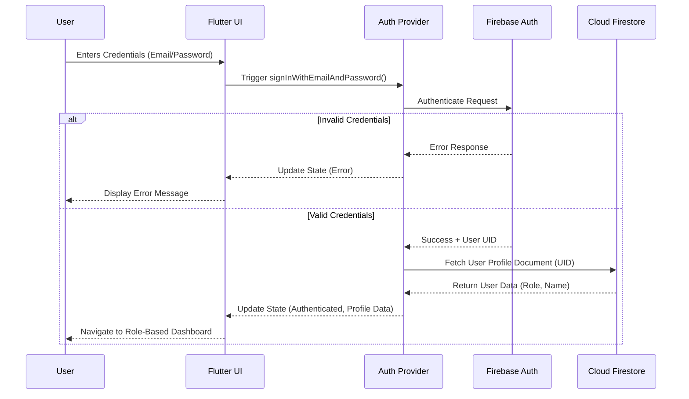
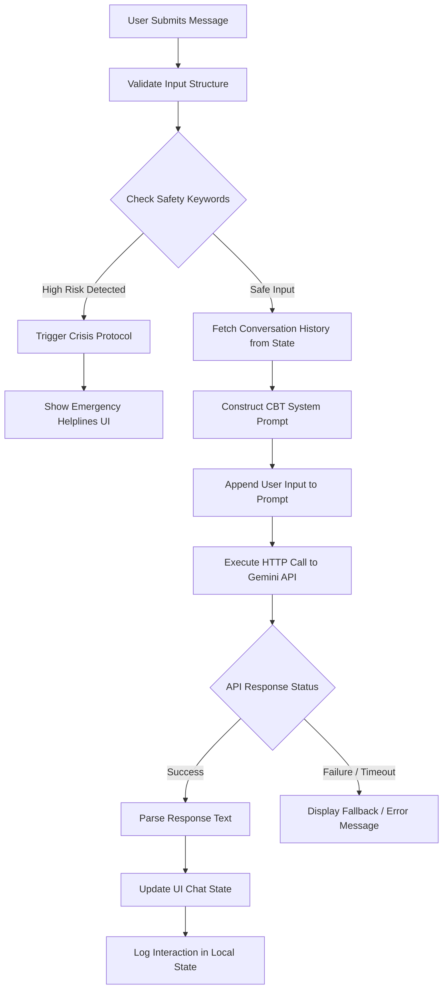
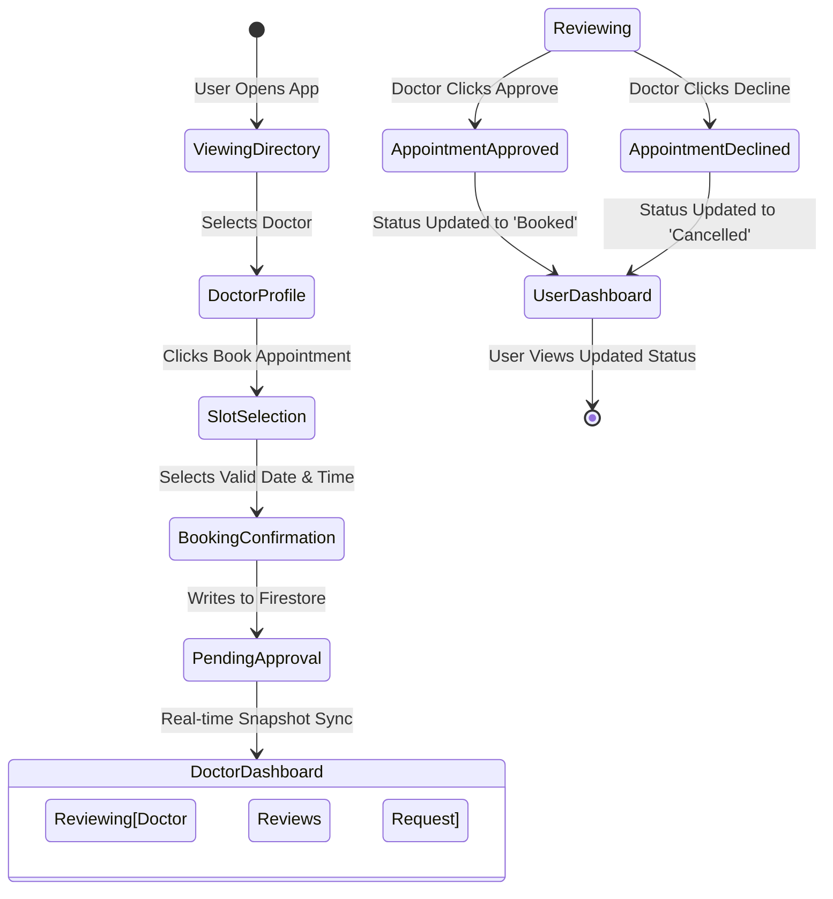
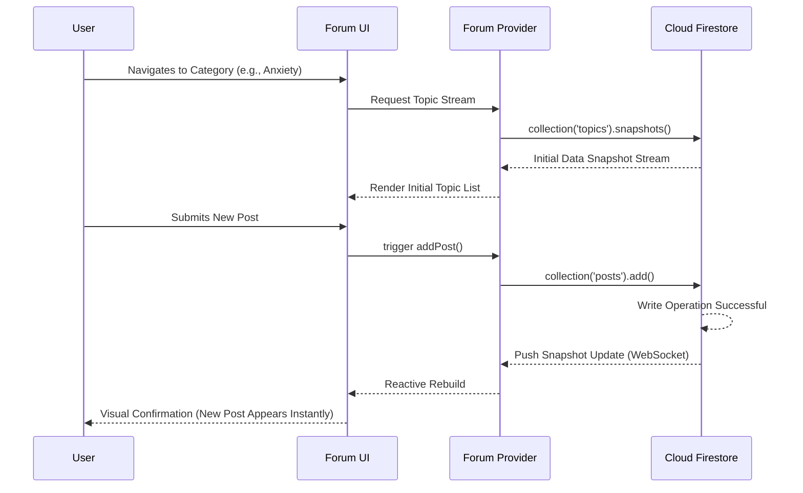
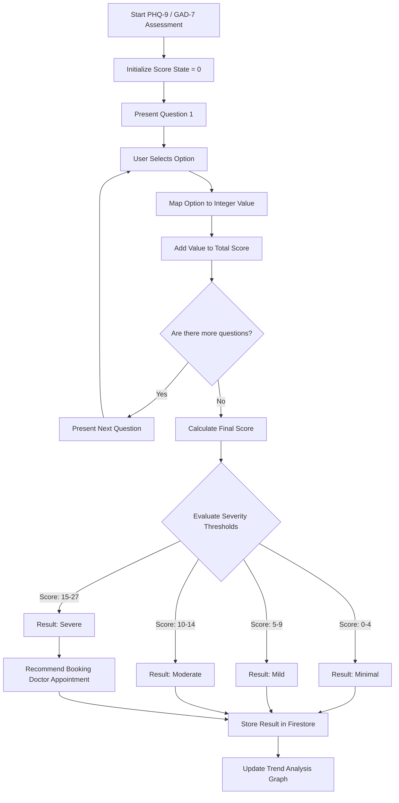

# In-Depth System Architecture and Flowcharts

This document provides comprehensive, in-depth visualizations of the system architecture and the intricate logical flows that govern the AI-Powered Mental Health Companion.

---

## 1. Complete System Architecture

This diagram illustrates the separation of concerns and the data flow between the client application, internal services, and external cloud/AI infrastructure.

```mermaid
graph TD
    subgraph Frontend "Flutter Application (Client)"
        UI[UI Components / Screens]
        State[State Management - Provider]
        UI <-->|Listens / Triggers| State
    end

    subgraph Business Logic "Services Layer"
        AuthSvc[Authentication Service]
        DbSvc[Database Service]
        AISvc[Gemini AI Service]
        State <-->|Method Calls| AuthSvc
        State <-->|Data Streams| DbSvc
        State <-->|Prompt Generation| AISvc
    end

    subgraph Backend "Firebase Ecosystem"
        FirebaseAuth[Firebase Authentication]
        Firestore[Cloud Firestore]
        AuthSvc <-->|Auth Tokens| FirebaseAuth
        DbSvc <-->|Read / Write / Snapshots| Firestore
    end

    subgraph External APIs "AI & External Integration"
        Gemini[Google Gemini 2.5 Flash API]
        AISvc <-->|REST HTTP Request / Response| Gemini
    end
```

---

## 2. In-Depth User Authentication & Session Management

This sequence diagram details the precise interaction during the user login phase, including role-based data retrieval.



---

## 3. In-Depth AI Therapist & CBT Processing Flow

This flowchart breaks down the internal logic executed during a single interaction with the AI chatbot, highlighting the safety override mechanisms.



---

## 4. In-Depth Appointment Lifecycle

This state diagram maps the lifecycle of a medical appointment request from the patient's initiation to the doctor's final decision.



---

## 5. In-Depth Community Forum Flow (Real-Time Sync)

This sequence diagram illustrates how Firestore's WebSocket streams automatically update the UI without requiring manual refreshes.



---

## 6. In-Depth Mental Health Assessment Scoring Flow

This flowchart maps the internal state transitions and conditional logic used during the execution of a PHQ-9 or GAD-7 clinical assessment.


